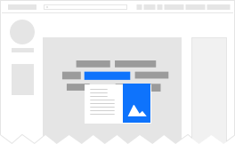

# mediawiki/extensions/Popups

See https://www.mediawiki.org/wiki/Extension:Popups for more information about
what it does.

## Development

Popups uses an asset bundler so when developing for the extension you'll need
to run a script to assemble the frontend assets.

You can find the frontend source files in `src/`, the compiled sources in
`resources/dist/`, and other frontend assets managed by resource loader in
`resources/*`.

After an `npm install`:

* On one terminal, kickstart the bundler process:
	* `npm start` Will run the bundler in watch mode, re-assembling the files on
		file change. Additionally, this builds debug-friendly assets and enables
    [Redux DevTools] debugging.
	* `npm run build` Will compile the assets just once, ready for deployment. You
		*must* run this step before sending the patch or CI will fail (so that
		sources and built assets are in sync).
* On another terminal, run tests and linting tools:
	* `npm test` To run the linting tools and the tests.
		* You can find the QUnit tests that depend on running MediaWiki under
			`tests/qunit/`
		* You can find the isolated QUnit tests under `tests/node-qunit/`, which you
			can run with `npm run test:unit`
	* We recommend you install a file watcher like `nodemon` to watch sources and
		auto run linting and tests.
		* `npm install -g nodemon`
		* Example running linting and node unit tests:
			* `nodemon -w src/ --exec "grunt lint:all && npm run test:unit"`
	* Get code coverage report with `npm run coverage`
		* Reports printed in the `coverage/` folder

Developers are likely to work with local MediaWiki instances that do not have
content to test with. To reduce this pain, you can create a single page with
a list of links that point to an existing and external wiki by using the
following config flag:

	$wgPopupsGateway = 'restbaseHTML';
	$wgPopupsRestGatewayEndpoint = 'https://en.wikipedia.org/api/rest_v1/page/summary/';

Popups works with a local copy of the [Mobile Content Service] too:

	$wgPopupsGateway = 'restbaseHTML';
	$wgPopupsRestGatewayEndpoint = 'http://localhost:6927/en.wikipedia.org/v1/page/summary/';

[Redux DevTools]: https://chrome.google.com/webstore/detail/redux-devtools/lmhkpmbekcpmknklioeibfkpmmfibljd
[Mobile Content Service]: https://gerrit.wikimedia.org/r/plugins/gitiles/mediawiki/services/mobileapps/+/master

## Debugging

* Popups are dismissed ("abandoned") when the cursor leaves the popup
  container. As such, it can be difficult to debug a popup of interest
  without it popping in and out of the DOM. A useful workaround in
  DevTools is to context click a link, select inspect, move the cursor
  some place comfortable, and then from the console enter
  `$($0).trigger('mouseenter')`.
* As described in [[#Development]], `npm start` enables Redux DevTools
  functionality. In production builds, this same functionality can be
  enabled by setting a `debug=true` query. E.g.,
  `https://en.wikipedia.org/wiki/Popup?debug=true`.
* When a QUnit test fails but you can't see why, open package.json and
  temporarily remove the snippet `| tap-mocha-reporter dot`.

## Storybook.js Component Library

The root of the repository contains a .storybook directory. This folder contains
a separate NPM project using the [Storybook.js](https://storybook.js.org/) UI framework.
This framework provides an environment that showcases all possible permutations of popups,
without the state-management constraints of having only one popup per page.

This framework requires Node 8 (because of the spread `...` operator) and is therefore
separated from the main package.json until CI upgrades from Node 6. NVM can be used to
manage multiple Node versions to run the Storybook app (`cd .storybook && nvm use`).
See the .storybook/README.md for details.

## Building the documentation

Execute `npm -s run doc`.

## Terminology

* Footnote - What the Cite extension shows at the bottom of the page.
* Hovercard - Deprecated term for popup.
* Link preview - A similar user feature in the Android native app.
* Navpop / nav pop - A popup-like UI from the NavigationPopups gadget.
* Popup - Generic term for a dialog that appears to float above a link that is
	being hovered over by a cursor.
* Page preview - A specific type of popup that shows a page summary.
* Preview - A synonym for popup.
* Reference - A specific type of popup that previews the Cite extension's
  footnotes. Since footnotes are typically used for references, and the tag's
  name is `<ref>`, the terms are used synonymously.
